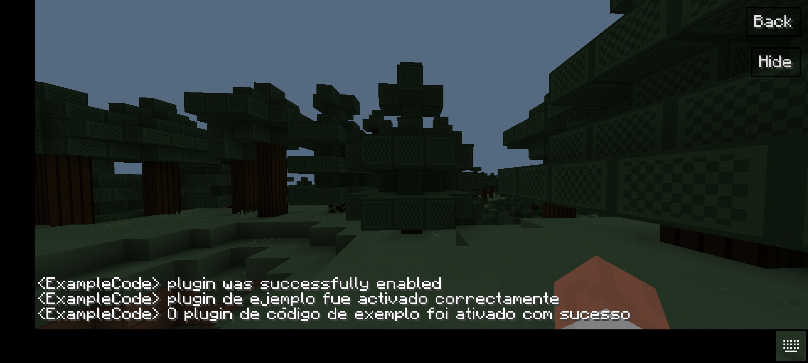

*Language API for PocketMine-MP (API Version: 2.0.0)*

**Tutorial**

**1.** Download the latest compiled plugin [here](https://github.com/xchillz/LanguageAPI/releases/latest).

**2.** Add it to your server as a plugin, run your server and stop it as soon as LanguageAPI plugin is enabled.

**3.** Go to LanguageAPI's data folder and add, modify or delete the languages as you desire!

**4.** Add it to your soft dependencies into your plugin.yml like this:

```yaml
name: YourPlugin
api: 2.0.0
version: 1.0.0
main: yourplugin\YourPlugin
softdepend:
  - LanguageAPI
```

**5.** Add some messages into a config file:

```yaml
messages:
  en_US:
    TEST: 'Test message'
  es_MX:
    TEST: 'Mensaje de prueba'
  pt_BR:
    TEST: 'Mensagem de teste'
```

**6.** Implement it into your Main class:

```php
<?php

declare(strict_types=1);

namespace yourplugin;

use languages\xchillz\exception\LanguageNotFoundException;use pocketmine\plugin\PluginBase;
use languages\xchillz\langs\LanguageManager;
use languages\xchillz\LanguageAPI;

final class YourPlugin extends PluginBase
{

    /** @var LanguageManager */
    private static $languageManager;

    public function onEnable()
    {
        $this->saveDefaultConfig();
    
        self::$languageManager = LanguageAPI::getInstance()->getLanguageManager();
        
        try {
            self::$languageManager->loadMessages($this->getConfig()->get('messages', []));
        } catch (LanguageNotFoundException $exception) {
            $this->getLogger()->logException($exception);
            
            // Handle this exception which is thrown if you declared messages to a language that is not registered into LanguageAPI's data folder.
        }
    }
    
    public static function getLanguageManager(): LanguageManager
    {
        return self::$languageManager;
    }

}
```

**7.** You are now ready to use it! Check [this folder](examples) to see some use cases and examples of how to use it deeply.

**Quick sample code:**

*plugin.yml sample code*
```yaml
name: ExampleCode
description: Send messages in three different languages to any player that joins the server.
api: 2.0.0
main: example\ExampleCode
version: 1.0.0
softdepend:
  - LanguageAPI
```

*Config sample code*
```yaml
messages:
  en_US:
    EXAMPLE_CODE_ON_ENABLE: '<ExampleCode> plugin was successfully enabled'
  es_MX:
    EXAMPLE_CODE_ON_ENABLE: '<ExampleCode> plugin de ejemplo fue activado correctamente'
  pt_BR:
    EXAMPLE_CODE_ON_ENABLE: '<ExampleCode> O plugin de código de exemplo foi ativado com sucesso'
```

*Main class sample code*
```php
<?php

declare(strict_types=1);

namespace example;

use languages\xchillz\LanguageAPI;
use pocketmine\plugin\PluginBase;
use languages\xchillz\langs\LanguageManager;

final class ExampleCode extends PluginBase
{

    /** @var LanguageManager */
    private static $languageManager;

    public function onEnable()
    {
        $this->saveDefaultConfig();
        
        self::$languageManager = LanguageAPI::getInstance()->getLanguageManager();
        
        try {
            self::$languageManager->loadMessages($this->getConfig()->get('messages', []));
        } catch (LanguageNotFoundException $exception) {
            $this->getLogger()->logException($exception);
            $this->getServer()->getPluginManager()->disablePlugin($this);
            return;
        }
        
        $this->getServer()->getPluginManager()->registerEvents(new PlayerJoinListener(), $this);
    }
    
    public static function getLanguageManager(): LanguageManager
    {
        return self::$languageManager;
    }
    

}
```

```php
<?php

declare(strict_types=1);

namespace example;

use pocketmine\event\Listener;
use pocketmine\event\player\PlayerJoinEvent;

final class PlayerJoinListener implements Listener
{

    public function onPlayerJoin(PlayerJoinEvent $event)
    {
        $player = $event->getPlayer();
        
        $player->sendMessage(ExampleCode::getLanguageManager()->getLanguageById('en_EN')->getMessage('EXAMPLE_CODE_ON_ENABLE'));
        $player->sendMessage(ExampleCode::getLanguageManager()->getLanguageById('es_MX')->getMessage('EXAMPLE_CODE_ON_ENABLE'));
        $player->sendMessage(ExampleCode::getLanguageManager()->getLanguageById('pt_BR')->getMessage('EXAMPLE_CODE_ON_ENABLE'));
    }

}
```

**Final result:**

